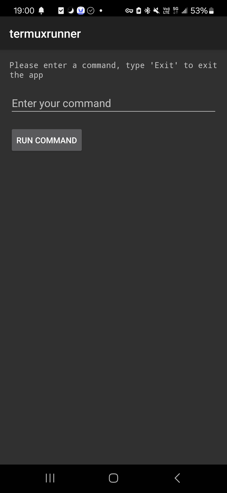
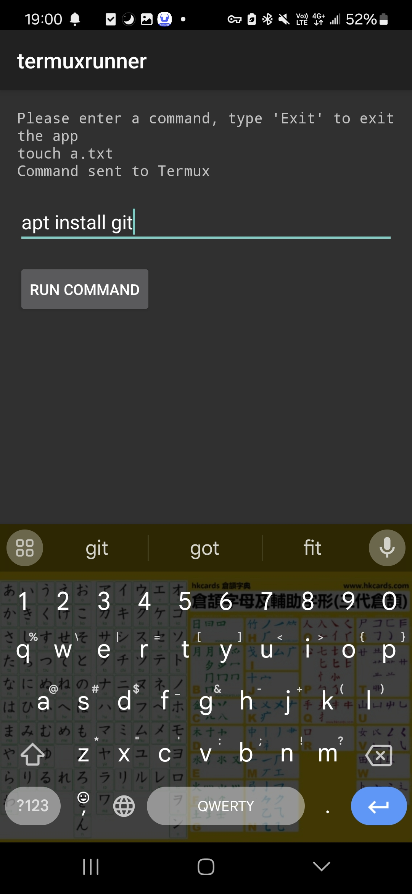

# termuxrunner
termuxrunner is an Android app that serves as an alternative frontend for Termux.
## Installation
<!--  -->

## App Screenshots

## Requirements
- Minimum Android version: API 21 (Android 5.0, Lollipop)
- Permission:
  - `android.permission.FOREGROUND_SERVICE`
  - `android.permission.BIND_JOB_SERVICE`
  - `com.termux.permission.RUN_COMMAND`
  - `android.permission.WAKE_LOCK`
## Credits
### AndroidIDE by AndroidIDE / AndroidIDEOfficial
- GitHub: [https://github.com/AndroidIDEOfficial/AndroidIDE](https://github.com/AndroidIDEOfficial/AndroidIDE).
- F-Droid: [https://f-droid.org/packages/com.itsaky.androidide/](https://f-droid.org/packages/com.itsaky.androidide/).
### ChatGPT by OpenAI
- Official website: [https://chatgpt.com/](https://chatgpt.com/).
## Contribution
We welcome contributions to this project! Please fork the repository and submit a pull request for your contributions. For clarity and convenience, we recommend making one pull request per revised section or added feature.
## License
Copyright (C) 2024 [Willie169](https://github.com/Willie169).\
This project is licensed under the terms of the **GNU AFFERO GENERAL PUBLIC LICENSE**, Version 3.0.\
You should have received a copy of the GNU Affero General Public License along with this software. If not, see [https://www.gnu.org/licenses/agpl-3.0.html](https://www.gnu.org/licenses/agpl-3.0.html).
